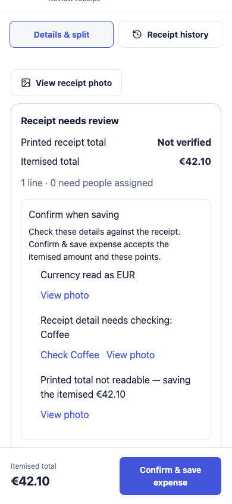
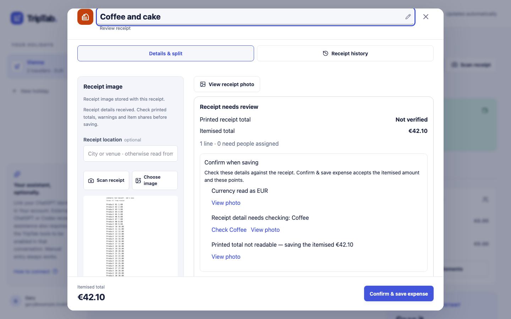
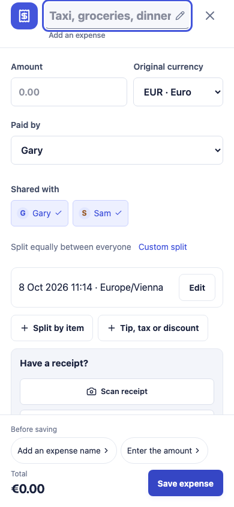
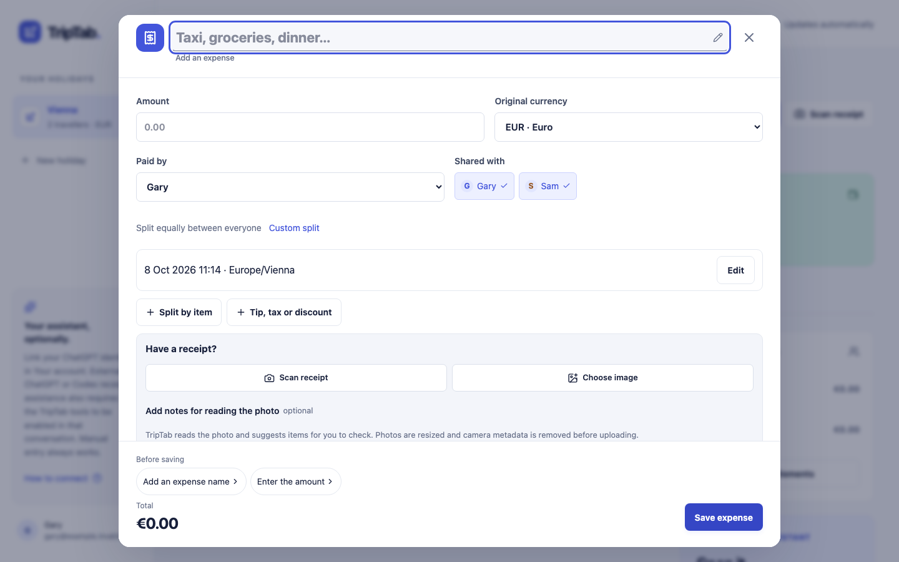
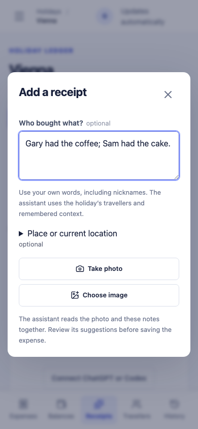
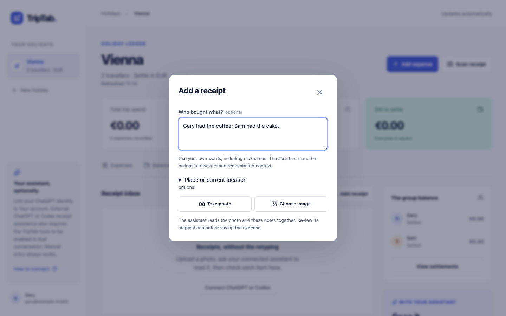

# Expense confirmation — 8 October 2026

The expense editor now explains corrections on Save and confirms receipt review in that same press. The five implementation phases start from TripTab main at `f7537fa`.

Save stays enabled unless a save request is running. Pressing it with blockers expands the complete checklist, announces it as an alert, and focuses the first correction. Readiness includes uploading, receipt processing, edit conflicts, offline state, pending required FX lookups and conversion bank charges in the settlement currency. During upload or reading it asks the user to wait rather than enter the incoming proposal's values.

Receipt review has one acceptance summary with actual amounts, selected currency, uncertain line names and links to item/photo evidence. The footer becomes **Confirm & save expense** when there are review points and no hard blockers. It computes the acknowledgement from final values immediately before posting, including setting the ambiguous selected currency's provenance before fingerprinting. No editing control creates an acknowledgement. Missing prices, names, mismatched currencies, unassigned items, invalid splits and absent conversion values still require correction.

The server treats a new user-confirmed currency as human review, so MCP cannot forge the currency-only case. Existing acknowledgement verification, draft binding, conflict checks, idempotency and proposal protections remain. A guard also prevents rapid repeated submit events from issuing two posting operations; server rejection retains the editor, and the success notice waits for acceptance.

The Ready to save card keeps the payer, totals and shares but has no submit button. The sticky footer is the only Save. The new top-level Scan receipt action opens the camera/picker directly, prepares the image and reuses editor capture. Inbox notes and place precede the photo controls; selecting a photo uploads and reads it immediately. Cancellation aborts the image request and invalidates its session, and replacing it cannot reopen an old photo or start another scan. Failed uploads retain their photo and notes for retry. Notes added later can still use the receipt conversation.

Suspicious manual FX rates appear in the FX panel and acceptance summary, with the measured percentage difference when a matching reference exists. There is no post-Save FX modal.

| Route | Observed presses |
| --- | --- |
| Manual expense | 2: Add expense, Save |
| Clean scan needing allocation | 3: Scan receipt, Share equally, Save |
| Inbox upload with an allocated clean scan | 3: Add receipt, Choose image, Save |
| Allocated receipt with ambiguity, missing total and uncertain lines | 1: Confirm & save |
| Allocated saved draft | 2: Review, Save |

Native file selection and typing are excluded from the press counts. A receipt still needing allocation takes that explicit sharing action before its final confirmation.

Validation:

- Production build and `npx tsc --noEmit` pass.
- Lint has zero errors and the four existing warnings.
- Full unit suite: 1,210 passed and four existing `pwa-live-refresh.test.ts` failures. The same four failures were reproduced with unchanged PWA sources on the base.
- Full Playwright suite: 216 passed across Chromium and WebKit. The final run permitted one retry but used none. Earlier WebKit runs intermittently missed pointer actions or stalled navigation; these did not recur in the final full run.
- Final currency-focus refinement: 24 confirmation browser checks and 19 readiness/render checks passed afterward.
- Coverage includes a 64-state rendered Save/blocker matrix, D1–D4, hard blockers together, final acknowledgement fingerprints after edits, browser versus MCP acceptance, click budgets, double-submit protection, server rejection, upload cancellation/replacement and inline FX review.

Screenshots use local API fixtures with synthetic amounts and a fixture receipt photo; they show no live trip data.

| Screen | Phone, 390 × 844 | Desktop, 1440 × 900 |
| --- | --- | --- |
| Receipt confirmation |  |  |
| Save feedback and name focus |  |  |
| Notes before photo selection |  |  |
