# Expense identity header — 7 October 2026

The expense name is now the editable heading, with the existing icon picker beside it. One tap edits the name; the mode heading still names the dialog. The suggested-name note sits directly below the header, and the identity controls remain available in Receipt history.

The phone header measures about 87 px at 390 × 844. Name, amount, currency, payer, people and Save remain on the opening screen. The input keeps its original change handler, required/max-length constraints, readiness target and exact accessible name, “Expense name”. QuickSplit retains receipt review's initial focus; other editors focus the title.

## Before / after

Before: `main` at `7c35d35`. After: this change. Chromium screenshots use matching local API fixtures, Gary and Sam, and a fixed clock of 7 October 2026 at 10:00 Europe/Vienna. The new expense has Taxi / £12.50 entered; the existing expense has two items; the processed receipt has matching totals and one unassigned item. Photos are fixture placeholders.

| View | Before | After |
| --- | --- | --- |
| New expense, 390 × 844 | 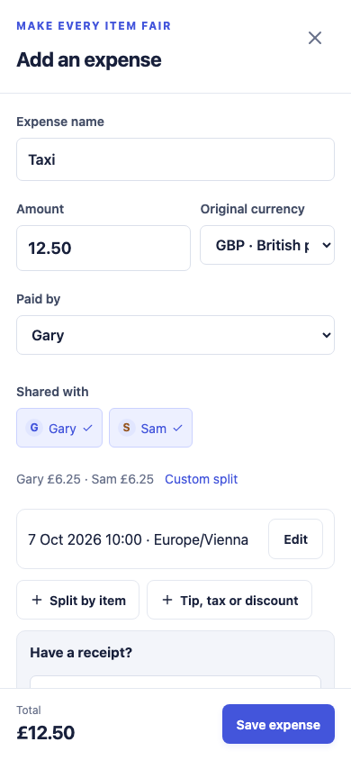 | 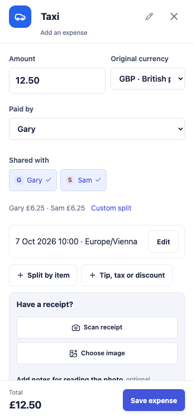 |
| Existing expense, 390 × 844 | 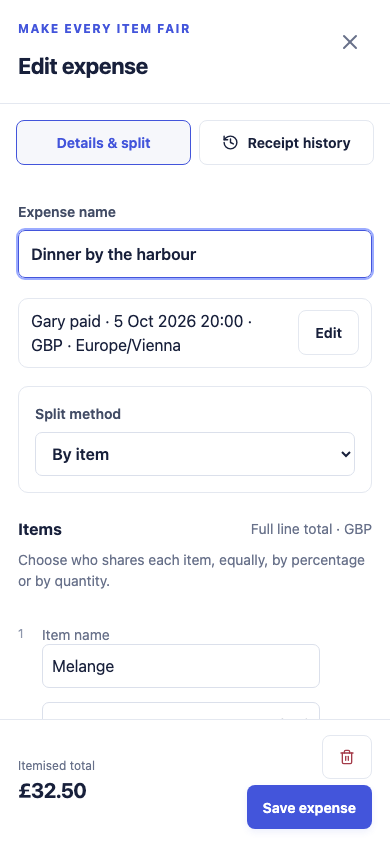 | 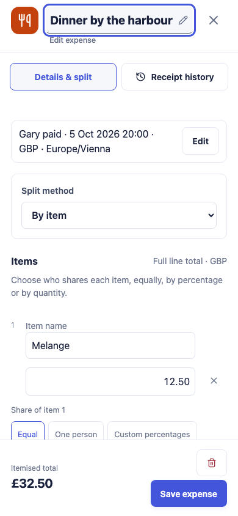 |
| Receipt review, 390 × 844 | 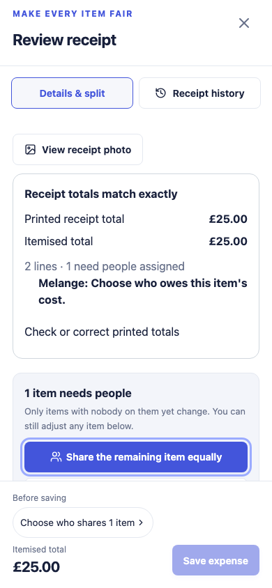 | 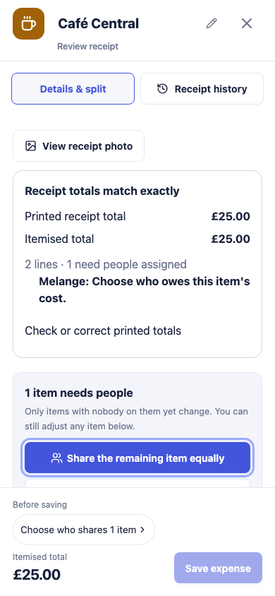 |
| New expense, 1440 × 900 | 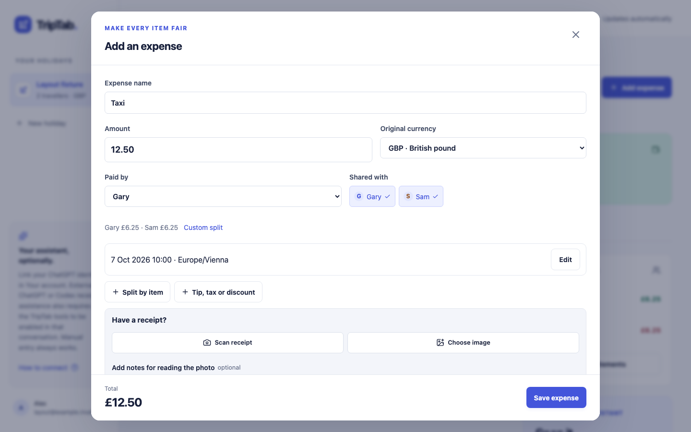 | 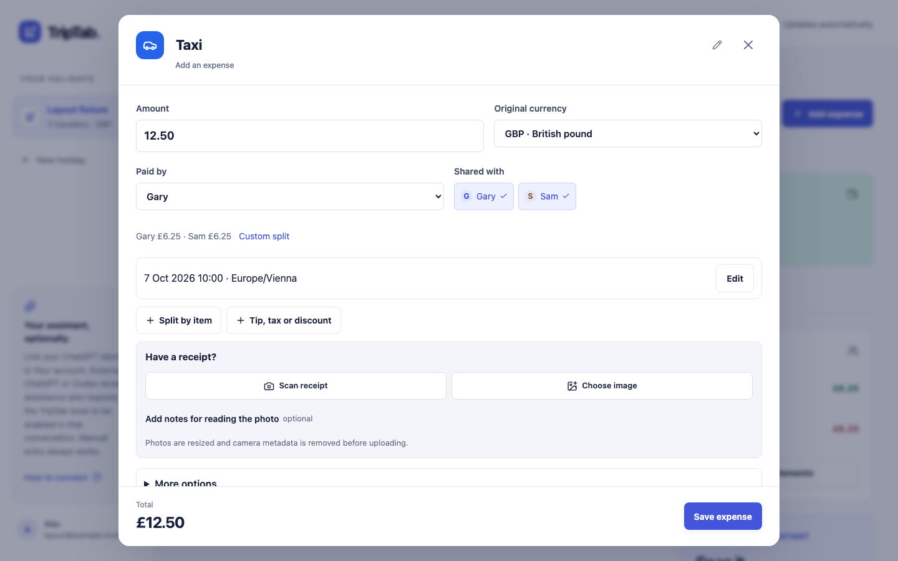 |
| Existing expense, 1440 × 900 | 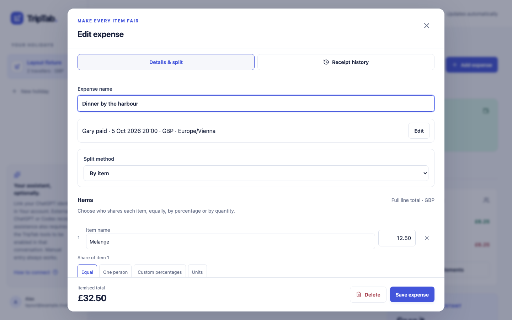 | 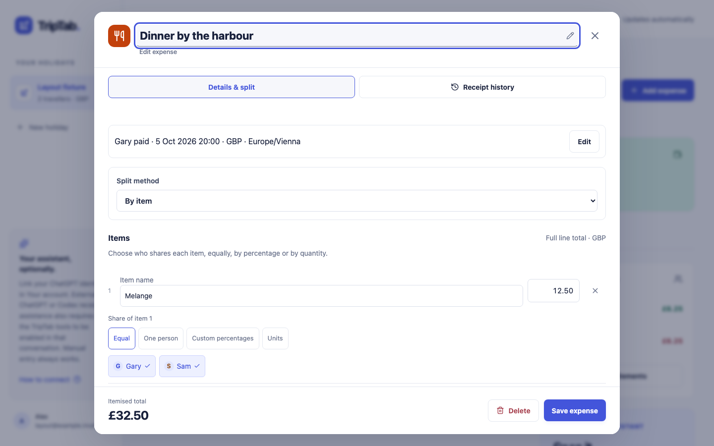 |
| Receipt review, 1440 × 900 | 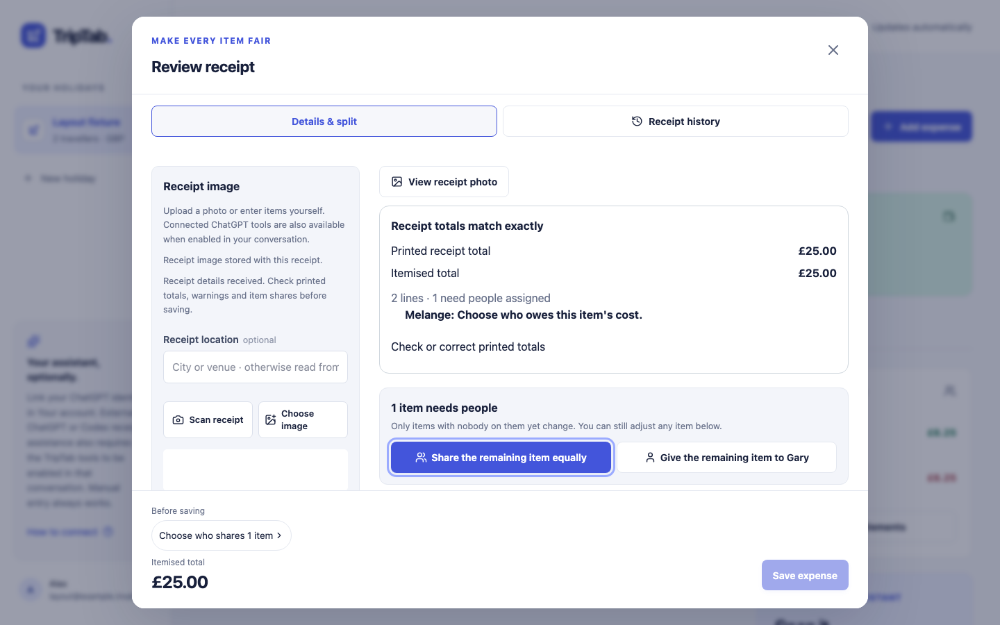 | 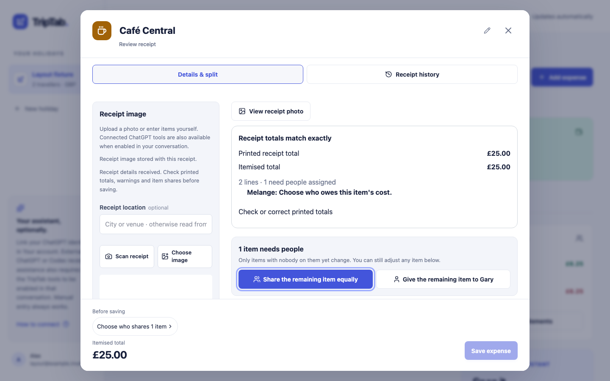 |

## Validation

- Production build and `npx tsc --noEmit` pass.
- `npm run lint`: zero errors, four existing warnings.
- `npm test`: 1,191 passed; four pre-existing failures in `pwa-live-refresh.test.ts`, reproduced with the unchanged main sources.
- Playwright: 100 tests across Chromium and WebKit. Coverage includes header placement and initial focus, quick-name linking, icon/background selection and save, unsaved-change guards, title provenance, receipt/history visibility, readiness jumps from a scrolled receipt, keyboard order, and 200-character names without horizontal overflow or displaced 44 px icon/close controls. Layout tests cover all eight existing viewports, including 320 × 740, 390 × 844 and 1440 × 900, plus enlarged text.

Physical iOS Safari still needs a keyboard check: tap the header name, edit it, and confirm the caret and header remain visible above the software keyboard. Automated WebKit tests do not show that keyboard.
