# Expense entry: progressive flow — implementation

8 October 2026 · Base: `main` at `b239d34` · Implements every recommendation in `expense-progressive-audit-2026-10-08.md`.

Adding an expense now uses one layout for every route, in three steps that never reorder: **1 Purchase**, **2 Split** and **3 Check & save**. Optional details open in place inside the step they belong to. A receipt's lines are compact rows that open for editing. A simple expense still takes two presses, a clean scan three, and a reviewed receipt one **Confirm & save**.

## Results

Same fixture and script (`expense-progressive-2026-10-08/measure.mjs`) at 390 × 844 for both builds. Both counts include only controls a person can see. The audit's first count also included content inside closed disclosures; `metrics-base-visible.json` is the corrected base measurement.

| Check | Base | Now | Target |
| --- | ---: | ---: | ---: |
| 7-line receipt: height | 9,040 px | 2,396 px | ≤ 2,600 ✓ |
| 7-line receipt: opening scroll | 712 px | 0 | 0 ✓ |
| 7-line receipt: first line, top | 1,848 px | 774 px | ≤ 844 ✓ |
| One line (collapsed) | 713 px, 16 controls | 117 px, 5 controls | ≤ 120 px, ≤ 6 ✓ |
| 7-line receipt: visible controls | 143 | 58 | ≤ 60 ✓ |
| 7-line receipt: words | 992 | 413 | ≤ 350 ✗ |
| "Nobody on this line" messages | 39 | 2 | ≤ 3 ✓ |
| Ways to open the photo | 4 | 1 | 1 ✓ |
| New manual expense: height | 1,119 px | 1,080 px | ≤ 1,119 ✓ |
| Foreign-currency manual expense: height | 1,685 px | 1,202 px | ≤ 1,250 ✓ |
| Custom split keeps amount, currency and payer in place | no | yes | ✓ |
| Corner radii in one view | 8 | 3, plus the icon tile | ≤ 3 ✓ |
| Font sizes in one view | 7–8 | 4–5 | ≤ 5 ✓ |
| Undefined CSS custom properties | 1 | 0 | 0 ✓ |
| Focus on `<body>` after an editor action | yes | never | ✓ |
| Desktop receipt: opening scroll / footer height | 495 px / 170 px | 0 / 97 px | — |

The word target is missed. Most of the remaining words are the people chips on each line: an initial and a name, four people on seven lines. They are the allocation controls themselves, so I kept them rather than cut text for its own sake.

Press counts are unchanged and covered by the existing browser tests:

| Route | Presses |
| --- | --- |
| Manual expense | 2 |
| Clean scan | 3 |
| Inbox upload | 3 |
| Reviewed receipt | 1 |
| Allocated draft | 2 |

## What changed

### Order (A1–A5)

- One layout for every entry (`components/trip-app.tsx`):
  - **Purchase:** receipt capture or the receipt's evidence; amount and currency, or currency and payer; the conversion; payer; date.
  - **Split:** bulk share, then the people for one amount or the lines.
  - **Check & save:** per-person shares, the points Save confirms, Receipt tools.
- `quickMode` no longer chooses a layout. It only decides whether Split shows one amount (`"manual"` or `"receipt"`) or lines.
- Paid by and Currency are always visible in Purchase. The collapsed row holds only the date, time and time zone.
- A receipt opens at the top: the bulk share, which takes focus without opening the keyboard, is now on the first screen.
- Before any photo, the receipt capture is a compact block at the top of Purchase rather than a card at the bottom.
- Every optional detail uses one pattern: a row with its current value and **Change**, opening in place.

### Splitting (S1–S4)

- `ShareSplit` is one control everywhere: people chips, then a method disclosure (Equally, By percentage, By quantity, plus By item for one amount).
  - A custom split happens in place.
  - **By item** turns the amount into line 1 without leaving the form.
  - **Use one amount** keeps the line's percentage or quantity shares, and asks first only when whole-bill shares, quantities or translations would be lost (`lib/quick-expense.ts`).
- "One person" is gone: choosing one chip already does it.
- Whole-bill percentages are a **By item / Whole bill** switch beside the Split heading.
- With nobody chosen, no method shows as selected and no error is printed (D3).
- Decision 1: a one-line receipt uses the single-amount layout (`singleReceiptLineEligible`).
  - Its line keeps its own name field, printed text, warnings and translations beside the amount.
  - The expense name never renames what was read.
  - `visibleExpenseBlockers` leads its corrections to those fields.

### Receipt lines (R1–R6)

- `components/expense-item-row.tsx`: a collapsed line shows its name (the preferred language first), price, a **Check** flag when something needs checking, and its people.
  - Opening it shows the names, price, removal, printed evidence, quantity, split method and discussion.
  - Lines that cannot be saved as they are open by themselves.
  - Jumps from Check & save or the checklist open a closed line.
- The per-line language display choice lives inside the open line (decision 2).
- "Nobody is on this line" is shown by the line's accent edge, the bulk bar's count and the footer. The review card, the per-line hint, the red 0% total and the per-line error no longer repeat it (R2).
- The receipt evidence block shows the photo thumbnail, the printed and itemised totals, hard warnings and **Check or correct printed totals**. "Ready to save" and "Each person's share" became the Check & save summary.
- `ReceiptCapture` renders in three parts:
  - `compact`: before any photo;
  - `status`: reading state and the next action, with the receipt's totals;
  - `tools`: replace or remove the photo, location, ChatGPT handoff and request, under Receipt tools.
- The duplicate "Changes ready to review" card is gone; **Review processed receipt** remains.
- One way to open the photo (R4): a thumbnail on phones and a large left column at 1024 px and wider, both opening the zoom dialog (`receipt-photo-viewer.tsx`).

### Currency (C1, C2)

- The conversion is one line under the amount: "≈ £94.65 · 1 EUR = 0.8612 GBP · Daily reference rate · date", with **Change** opening the manual rate and the actual bank charge.
- It opens by itself only for a failed lookup, a suspicious manual rate or a bank charge still to enter.
- The rate shows six significant figures (D5). **Use the daily reference rate** appears only beside a manual rate.
- The estimate no longer waits for the split, so it shows before anyone is assigned (D2).
- The field is labelled **Currency**.

### Capture (P1)

- The list, the editor and the inbox dialog use the same labels (**Scan receipt**, **Choose image**, **Receipt location**) and the same privacy sentence.
- Notes come before the capture buttons in both places.

### Header and footer

- Receipt history is a header action beside Close, with **Back to details & split** in the history view (decision 4). This frees the row the tab bar took.
- The mode caption has room below the name.
- The checklist has no title row. From 720 px wide it shares the footer row with Total and Save.

### CSS (V1–V8)

- Tokens in `app/globals.css`, all with dark values:
  - spacing 4–32 px;
  - radius 8, 12 and pill;
  - type sizes 0.8–1.5 rem;
  - surface, border, label, chip, warning and hover colours.
- `--border` is defined, so the dark-mode review border is fixed (D4). `--surface-raised` no longer stands for two colours.
- All editor styles moved into `components/expense-editor.css`, spaced with `gap` instead of margins on children.
- Removed:
  - `expense-quick-review.css` and `receipt-editor-layout.css`;
  - about 525 lines of editor rules from `globals.css` (net 487 after the new tokens);
  - the editor-only rules in `receipt-upload.css` and `receipt-languages.css`.
- That removal took with it the duplicate `.personchips button`, `.save-checklist` and focus rules, and the dead `.receipt-total-ack`, `.receipt-save-block`, `.receipt-review-all`, `.receipt-preview` and `.currency-pair` rules.
- Without a photo the dialog is at most 680 px wide (V8).
- Item discussions and the receipt language appear only for receipts, when receipt AI is available or a discussion exists (D6). Focus moves to the Split heading after a bulk share (D1).

## Decisions taken

1. One-line receipts use the single-amount layout, as recommended.
2. The per-line language display choice stays inside the open line.
3. Steps have numbered headings.
4. Receipt history became a header action. The audit had no recommendation here; it frees the row the first screen needed.

## Tests

- Updated to the new structure, keeping the behaviour each one protects: `quick-expense`, `expense-flow`, `expense-layout` and `expense-confirmation` specs; `receipt-scan-ui`, `receipt-capture-handoff`, `share-split`, `quick-expense-collapse` and `receipt-render-performance` unit tests.
- New `tests/browser/expense-progressive.spec.ts`:
  - three steps on every route, with payer and currency in Purchase;
  - a 7-line receipt opening at the top with lines of 120 px or less and each fact said once;
  - focus after a bulk share;
  - the conversion estimate before assignment;
  - one photo affordance;
  - checked lines opening from Check & save;
  - no receipt conversation on a typed expense without AI;
  - matching capture wording;
  - the desktop photo column and narrow dialog;
  - theme borders in dark mode.
- New unit tests:
  - no method shown as selected and no error before anyone is chosen;
  - closed lines show people without methods;
  - the single-amount form keeps one person;
  - single receipt lines;
  - single-amount blocker mapping.

## Validation

- `npx tsc --noEmit` passes. `npm run lint` reports no errors and 3 warnings, all of them existing; base has 4.
- `npm test`: 1,217 passed. The 4 failures in `pwa-live-refresh.test.ts` also fail on unchanged `main` in a separate worktree.
- Playwright, Chromium, local production build: 123 passed, including every layout viewport and enlarged text.
- WebKit isn't installed in this environment; CI runs it.
- Physical iOS and Android keyboards are still unchecked.

## Screenshots

Before: `expense-progressive-2026-10-08/` (numbered). After: `expense-progressive-2026-10-08/after/`, same fixture and numbering.

| View | Before | After |
| --- | --- | --- |
| New expense, 390 | 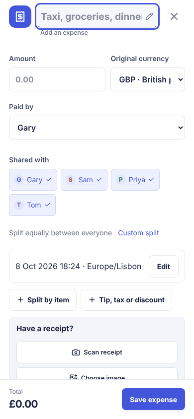 | 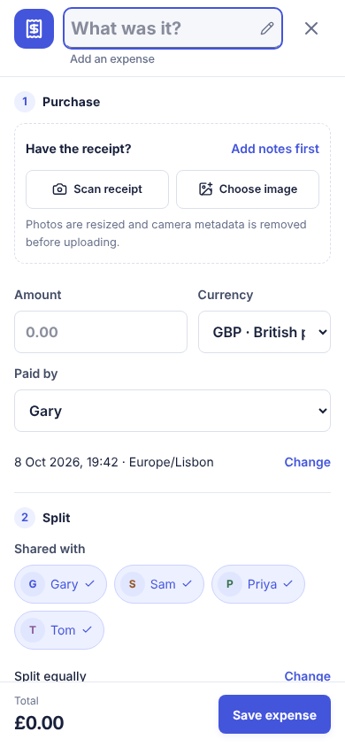 |
| Custom split, 390 | 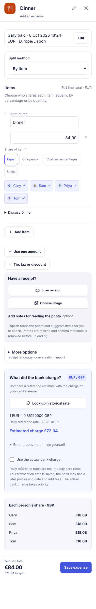 | 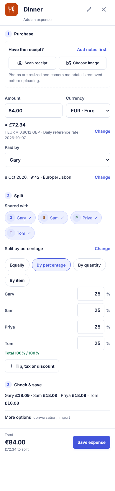 |
| Receipt as opened, 390 | 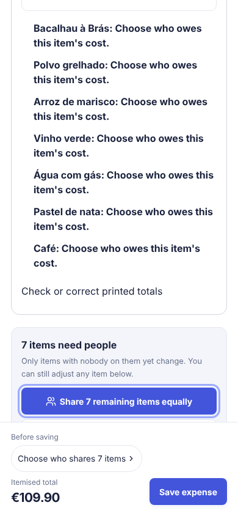 | 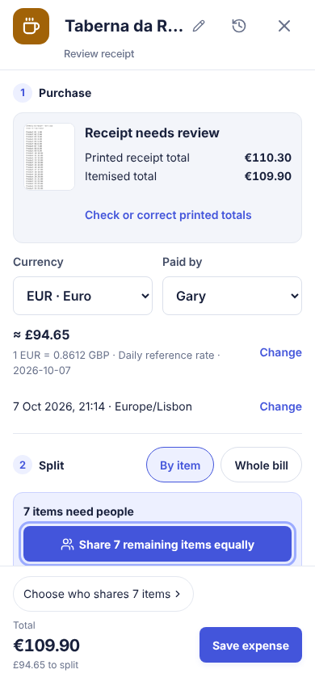 |
| Whole receipt, 390 | 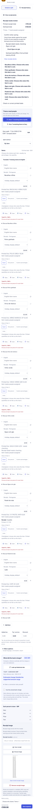 | 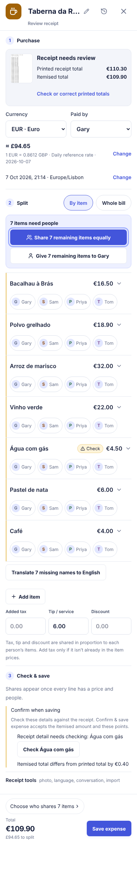 |
| Receipt, 1440 | 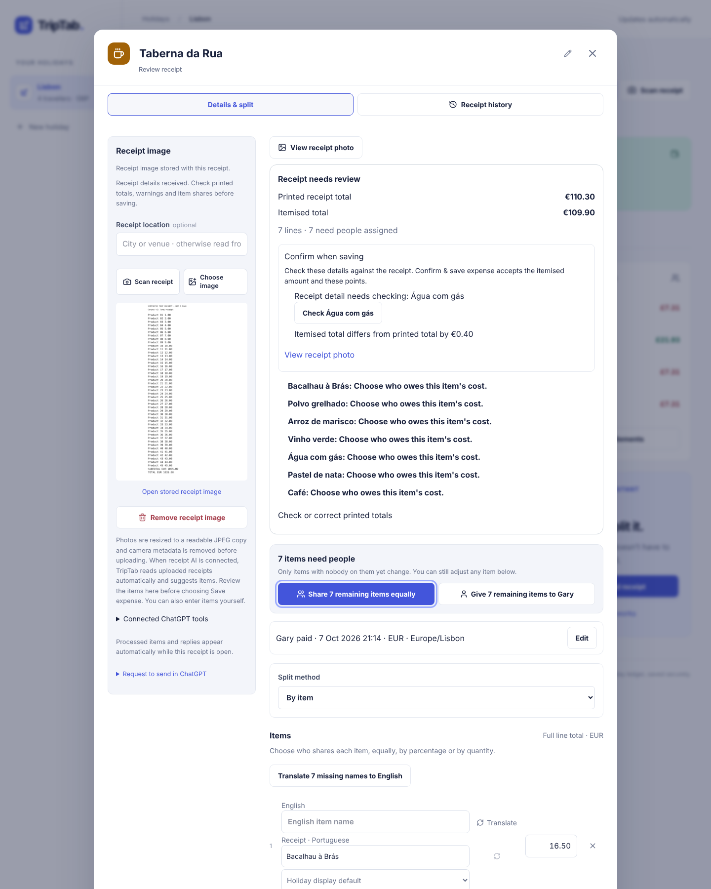 | 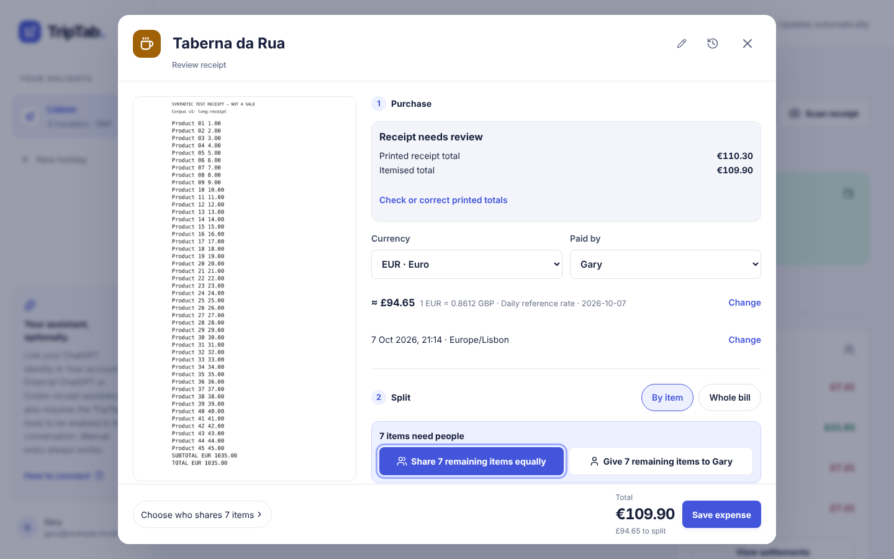 |
| Dark mode, 390 | 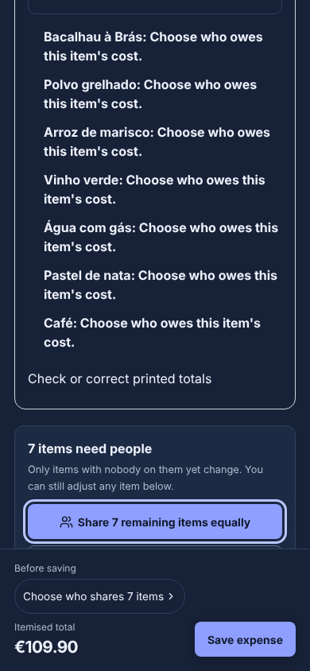 | 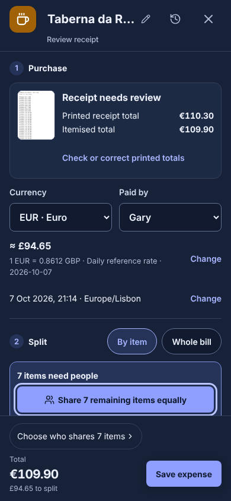 |
